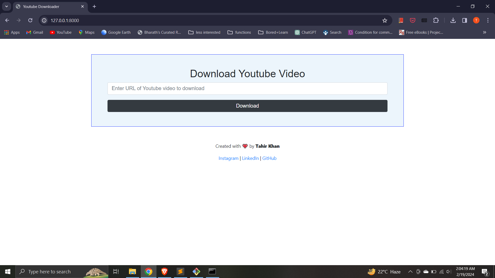

# YouTube Video Downloader

<p align="center">
  
</p>

## About

YouTube Video Downloader is a web application built on the Laravel framework that allows users to download YouTube videos by providing the video link.

## Features

- **Video Download**: Users can input a YouTube video link and download the video directly from the application.
- **Ease of Use**: Simple and intuitive interface for hassle-free video downloads.
- **Robust Backend**: Built on Laravel, ensuring stability, security, and scalability.

## How to Use

1. Clone the repository:

   ```bash
   git clone https://github.com/Tahirkhan7/Youtube-Downloader.git

2. Install dependencies:

   ```bash
   composer install

3. Set up your environment configuration by copying the .env.example file to .env:

    ```bash
   cp .env.example .env

4. Generate an application key:

   ```bash
   php artisan key:generate

5. Configure your database settings in the .env file

6. Run migrations:

    ```bash
   php artisan migrate

7. Start the development server:

    ```bash
   php artisan serve

## Output
- Once the development server is running, open your web browser and navigate to the URL provided by the php artisan serve command.
- You will see the YouTube Video Downloader interface.
- In the input field provided, enter the URL of the YouTube video you want to download.
- Click the "Download" button.
- The application will process the video and provide you with a download link.
- Click the download link to save the video to your device.



## License

The Laravel framework is open-sourced software licensed under the [MIT license](https://opensource.org/licenses/MIT).

---

Connect with me on:
<div id="badges">
  <a href="https://www.linkedin.com/in/tahirkhan7" target="_blank">
    
  </a>
  <a href="https://www.instagram.com/taahirkhann">
    
  </a>
</div>
